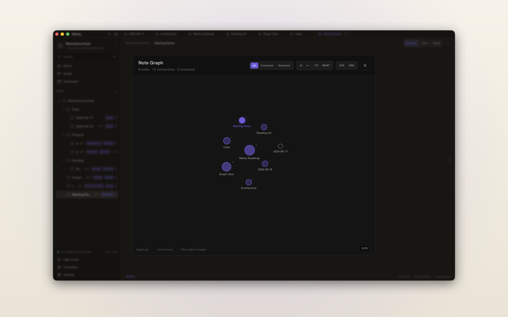
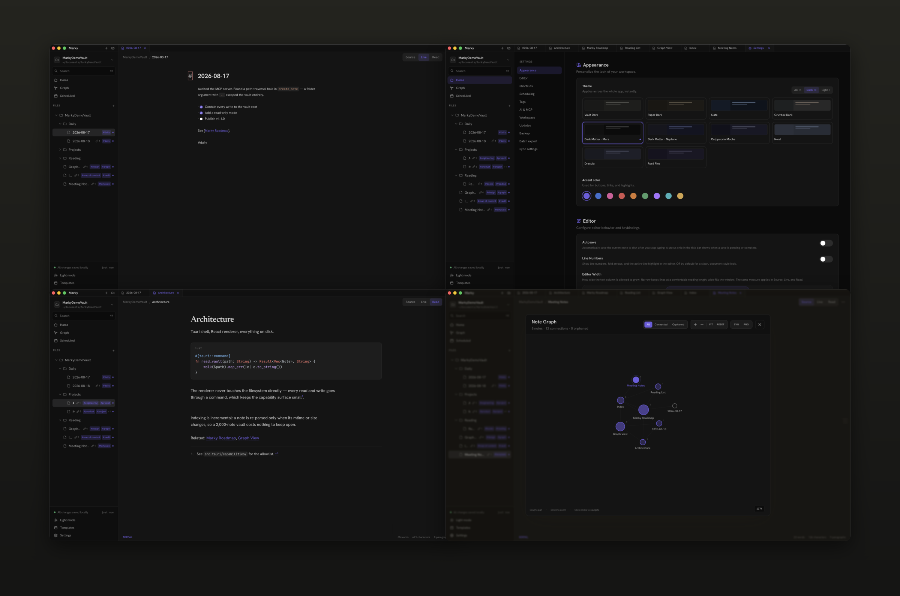
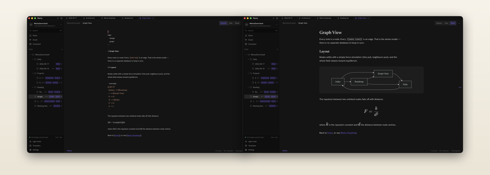

<p align="center">
  
</p>

<h1 align="center">Marky</h1>

<p align="center">
  Offline-first Markdown notes with local folders, wiki links, graph navigation, and a polished desktop editor.
</p>

<p align="center">
  <a href="https://github.com/amiralibg/marky/releases/latest"><strong>Download the latest release</strong></a>
  ·
  <a href="https://marky.amiralibg.xyz"><strong>Website</strong></a>
  ·
  <a href="docs/mcp-server.md"><strong>MCP setup</strong></a>
</p>

<p align="center">
  
</p>

Marky is an offline-first Markdown notes app built with Tauri, React, and Rust.
It is designed for local folder-based note-taking with wiki links, graph navigation, a modern editor, and strong customization.

Your notes are ordinary Markdown files in an ordinary folder. No account, no cloud, no database — git them, sync them, or leave them on a USB stick. Native installers stay under 10 MB.

<p align="center">
  
</p>

## Download

Download the latest desktop build from the [Marky releases page](https://github.com/amiralibg/marky/releases/latest). Installers are attached to each GitHub release after the app is built.

Current version: [`v1.7.1`](https://github.com/amiralibg/marky/releases/tag/v1.7.1).

## Highlights

- Local-first workspace (notes are normal files in your folder)
- Saves itself as you type — nothing to remember, nothing left unsaved
- CodeMirror 6 editor with split/preview modes
- Wiki links (`[[Note]]`) with backlink tracking
- Interactive graph view for note connections
- Global fuzzy search across note titles and content
- Command palette for quick actions and note switching
- Templates and scheduled note creation (daily/weekly/monthly)
- Markdown extensions: Mermaid, KaTeX math, footnotes, code highlighting
- Themes, accent colors, app-wide text size, customizable keyboard shortcuts, Vim mode
- AI integration via Model Context Protocol (MCP) Server for Claude Desktop, Cursor, etc.
- Workspace ZIP backup export
- File watcher sync for external changes (other editors, git pulls, etc.)

## Features

### AI & Model Context Protocol (MCP)

- Built-in MCP Server (`@marky-app/mcp-server`) connects your notes to **Claude Code**, **Claude Desktop**, **Cursor**, **OpenCode / Cline**, **ChatGPT**, **Zed**, and other AI tools
- AI tools can fuzzy search notes, read full content, create new notes, append daily logs, inspect backlinks, and query tags
- In-app 1-click config generator in Settings -> AI & MCP for all major AI clients
- See the [MCP Server Guide](docs/mcp-server.md) for setup instructions

### Notes and workspace

- Open a local folder as your workspace
- Nested folders and notes tree
- Multi-tab editing
- Create, rename, move, and delete notes/folders
- Drag-and-drop reorganization
- Recent notes and pinned notes
- Undo last delete

### Editor and preview

<p align="center">
  
</p>

The same note in source view and reading view — Mermaid diagrams and KaTeX maths render inline, and it is still just Markdown on disk.

- CodeMirror 6 markdown editor
- Editor-only / split / preview-only layouts
- Saves as you type — no save step, and no unsaved notes (manual save is still available)
- In-editor search and replace
- Wiki-link autocomplete and broken-link note creation flow
- Table of contents panel for headings
- Focus mode (distraction-free writing)
- Automatic BiDi/RTL rendering for mixed-language notes

### Discovery and navigation

- Global search modal (Fuse.js fuzzy search)
- Command palette (`Cmd/Ctrl+K`)
- Backlink counts in the notes tree, and backlink-weighted node sizes in the graph
- Interactive graph modal: force-directed layout, drag a node to reshape it, cursor-anchored zoom
- Sidebar search, sorting, and tag filtering

### Templates, scheduling, export

- Built-in templates and custom templates
- Scheduled note generation (daily/weekly/monthly)
- Scheduled notes management UI in Settings
- Export note as Markdown or HTML
- Print-friendly HTML export for PDF workflow
- Copy rendered HTML to clipboard
- Export workspace backup as ZIP (with metadata/settings)

## Tech Stack

- Frontend: React 18 + Vite
- Desktop runtime: Tauri 2 (Rust backend)
- State: Zustand
- Editor: CodeMirror 6 (+ Vim mode via `@replit/codemirror-vim`)
- Markdown rendering: `marked` + extensions
- Search: Fuse.js
- Diagrams: Mermaid
- Math: KaTeX
- Archive export: JSZip

## Getting Started

### Prerequisites

- Node.js (latest LTS recommended)
- Rust toolchain ([rustup](https://rustup.rs/))
- `pnpm`

### Install

```bash
pnpm install
```

### Run (desktop app)

```bash
pnpm tauri:dev
```

### Run frontend only (optional)

```bash
pnpm dev
```

## Build

Build a production desktop app:

```bash
pnpm tauri:build
```

Typical outputs are generated under `src-tauri/target/release/bundle/` (platform-specific subfolders such as `dmg`, `msi`, `deb`, etc.).

Common release artifacts:

- macOS: `src-tauri/target/release/bundle/dmg/*.dmg`
- Windows: `src-tauri/target/release/bundle/msi/*.msi`
- Linux: `src-tauri/target/release/bundle/deb/*.deb` and/or `src-tauri/target/release/bundle/appimage/*.AppImage`

## Testing

Run the unit test suite:

```bash
pnpm test
```

For testing strategy, priorities, and examples, see `docs/testing.md`.

## Release

Before publishing a release, make sure the app version is the same in:

- `package.json`
- `src-tauri/Cargo.toml`
- `src-tauri/tauri.conf.json`

The release workflow builds macOS, Windows, and Linux installers automatically and uploads them to a GitHub Release.

### Automatic release from a tag

Use this when the code is ready and committed:

```bash
git status
git add package.json src-tauri/Cargo.toml src-tauri/tauri.conf.json
git commit -m "chore: release v1.2.4"
git tag v1.2.4
git push origin main --tags
```

When the `v1.2.4` tag is pushed, `.github/workflows/release.yml` runs on GitHub Actions and creates the GitHub Release for that tag.

### Automatic release from the GitHub UI

Use this if you want to release the current commit without creating a local tag:

1. Open the repository on GitHub.
2. Go to **Actions** -> **Release** -> **Run workflow**.
3. Enter a tag such as `v1.2.4`.
4. Choose whether it is a prerelease.
5. Run the workflow.

The workflow uses `GITHUB_TOKEN`, so no custom token is required for normal GitHub Releases.

### Local build only

Use this only when you want to test installers locally:

```bash
pnpm install
pnpm tauri:build
```

## Keyboard Shortcuts (defaults)

- `Cmd/Ctrl+K`: Command palette
- `Cmd/Ctrl+Shift+F`: Search all notes
- `Cmd/Ctrl+N`: New note
- `Cmd/Ctrl+Shift+N`: New folder
- `Cmd/Ctrl+S`: Save note
- `Cmd/Ctrl+B`: Toggle sidebar
- `Cmd/Ctrl+W`: Close tab
- `Cmd/Ctrl+1/2/3`: Editor / Split / Preview views
- `Cmd/Ctrl+Plus` / `Cmd/Ctrl+Minus`: Larger / smaller app text (`Cmd/Ctrl+0` resets)

Shortcuts are customizable in Settings.

## Project Structure

- `/src` - React UI, stores, editor, components
- `/src-tauri` - Rust/Tauri backend and desktop config

## Roadmap

See [`TODO.md`](TODO.md) for the current audit-based roadmap and prioritized next work.

## License

MIT. See [`LICENSE`](LICENSE).
